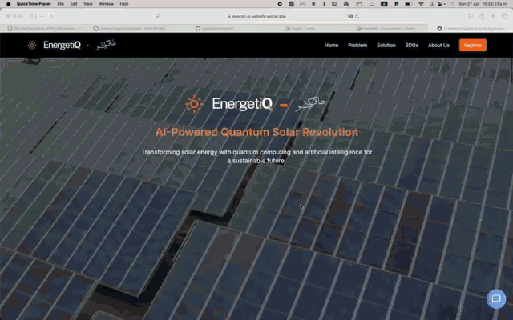
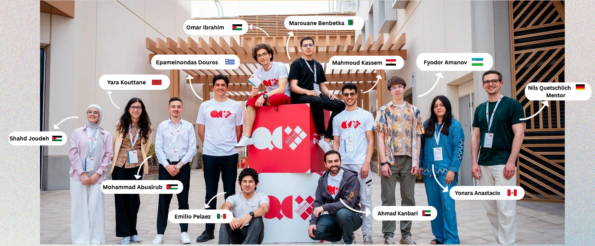

> 🥈 **Second Place Winner — Hackathon (out of 17 teams)!**

# EnergetiQ

  

## Problem statement

Batteries in the UAE and in the general gulf region suffer from the extreme heat conditions they are constantly exposed to. Battery storage loses efficiency through exposure to this heat, losing crucial solar energy generated throughout the day and needed for the night. Therefore, EnergetiQ addresses the following: _How to reduce the heat-induced inefficiency of batteries? If more efficient batteries are available, how do we place them?_

## Our solution

To tackle this problem, we developed a platform for material analysis and battery placement through quantum computation and machine learning. We put our full pipeline solution into a website aimed at selling our solution to customers like government entities and city planners. In this website, a customer can explore the properties of different potential materials under heat. Once batteries are available to the user, their placement can be optimized based on population and heat maps.

You can visit our _platform_ [here](https://energti-q-website.vercel.app).

## Quantum Computing for Battery Design

Currently, we use a variational approach (VQE + QEOM algorithms) to analyze the properties of a material under heat. Through our quantum algorithm, we extract the energy spectrum of a molecule, which we can then use to compute properties of the material that characterize its response to heat. With phase estimation, we can likewise compute the energy spectrum with higher accuracy and larger molecules. Currently, Microsoft's resource estimation estimates around 500k qubits needed for a fully fault-tolerant implementation of our phase estimation solution. Using this tool, we can optimize our approach before even having access to such systems. The code for our quantum solution is available [here](https://github.com/epelaaez/EnergetiQ/tree/main/battery_design).

## Machine Learning for Battery Placement

We optimized battery placement using Weighted K-Means Clustering, a machine learning technique that intelligently groups locations based on a custom efficiency score. This score combines population density and temperature data, rewarding areas with more people and cooler climates. By applying these scores as weights during clustering, the algorithm prioritizes regions where batteries can deliver the highest impact and long-term efficiency. This strategy ensures cost-effective deployment, greater energy accessibility, and supports a smarter, greener, and more resilient city infrastructure. The code for our machine learning solution is available [here](https://github.com/epelaaez/EnergetiQ/tree/main/battery_optimization).

## Roadmap into the future

Our short, medium, and long term goals include:

-   Now: variational approach and focus on the UAE region.
-   In 6 months: run on hardware, optimize phase estimation approach, and focus on Asia and South America.
-   In 3 years: run phase estimation approach on hardware and provide solution as SaaS (software as a service).

## Team

Meet the team!

  

